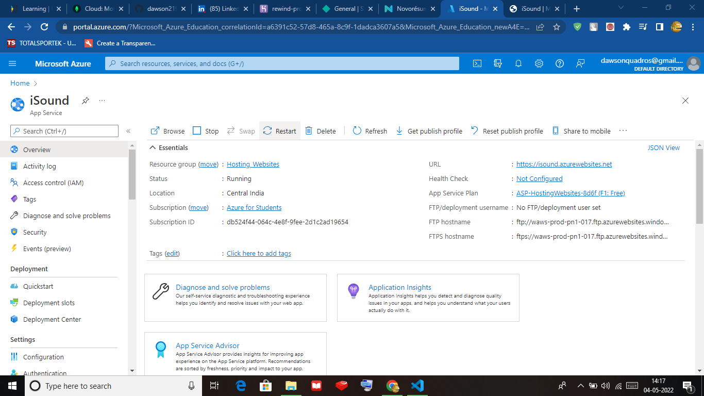
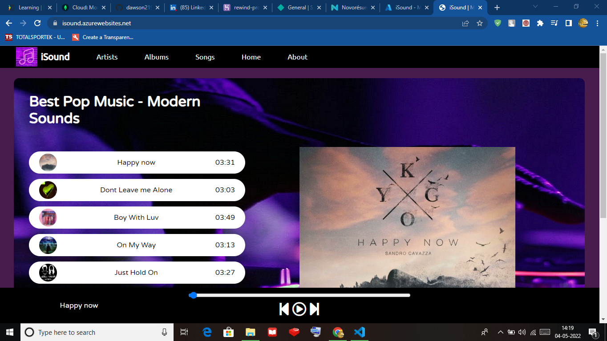
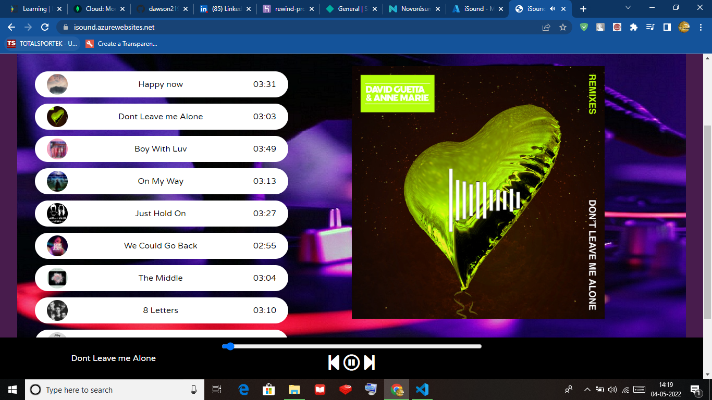
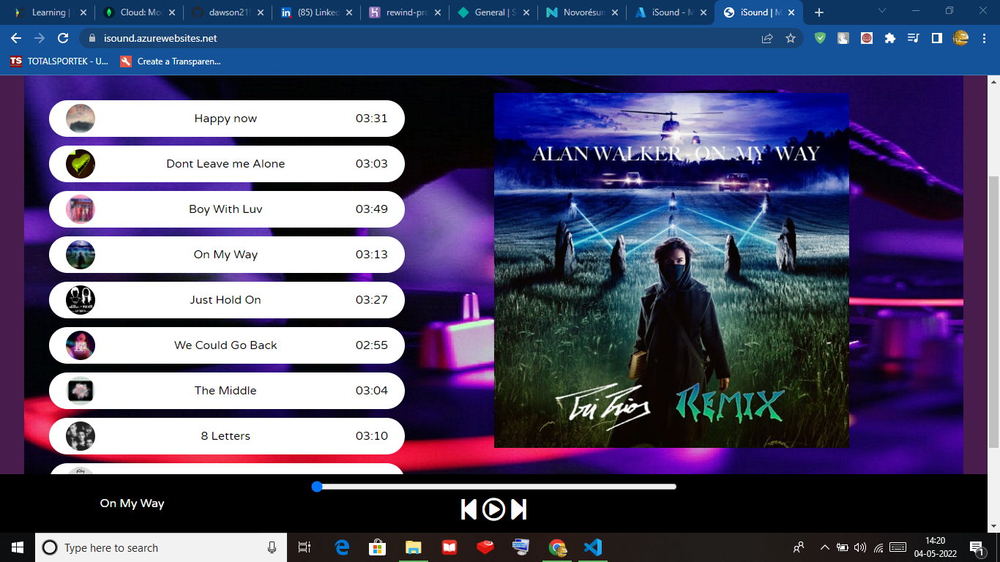
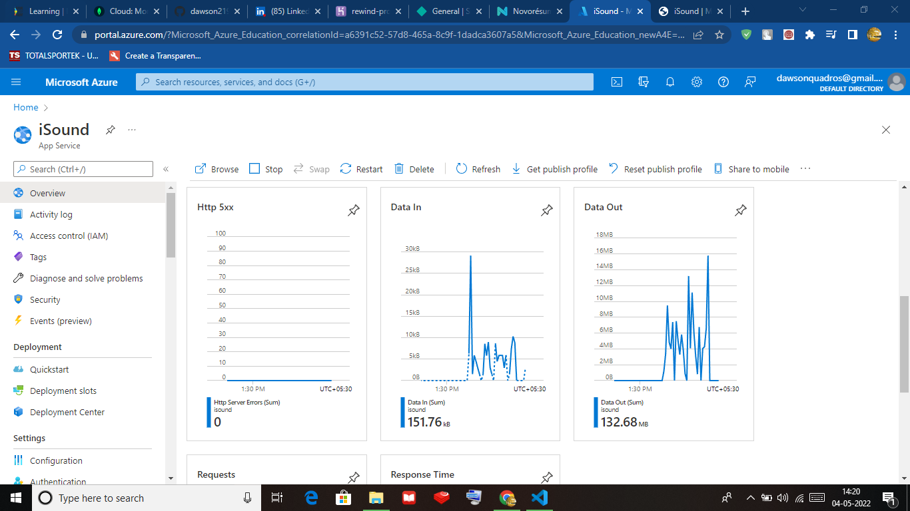
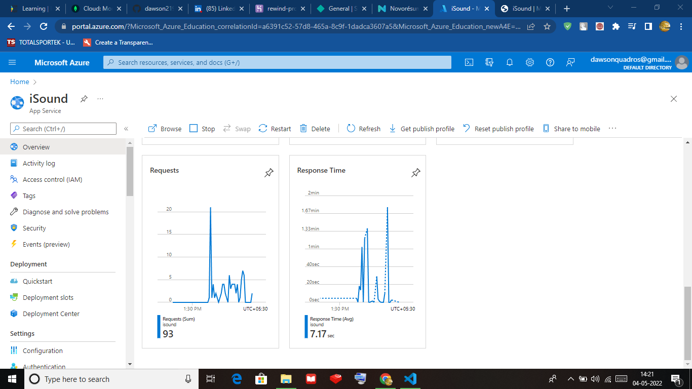
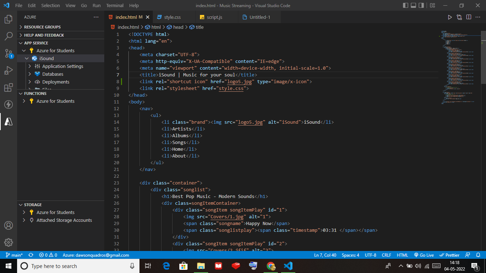

# iSound---Music-Streaming-App
This is my Project for the Microsoft Future Ready Talent Internship

Project Topic : iSound - Music Streaming Website

Here is the Project Link: 
(Note: The playing of songs is dependent on internet speed, wait some time for the songs to play. Also click on the white space next to the names of the songs to play any song. You can also use the next and previous button on the player at the bottom to change songs.)

Here is the Project Video Demo Link: https://drive.google.com/file/d/1VGv32qVmEf0gvBAQMs_4OTn7muFwaVhS/view?usp=sharing

Azure Technologies Used: Azure App Service , Azure App service VS Code Extension.
Technologies Used in Project: HTML , CSS , JavaScript.

Here are the Reasons I chose Azure App service to Host my Website:
1) Highly Secure Web Apps Development
2) Multilingual and Versatile Framworks like ASP.NET, Node.js, Java, PHP, Python.
3) Global Scale and High Availability
4) Quick Analytics and Actionable Insights

iSound is a hip new website where you can play your favourite songs, it has functionalities like , play/pause , previous song, next song and a seekable progress bar.

Here is the Azure service resource in the Azure Portal:

Here are the Screenshots of the Working of the Websites:

We can See that the Website is hosted at : isound.azurewebsites.net

Here are the analytics for the Website:

I used the Azure App Service VS Code extension to deploy my code to the Web App

