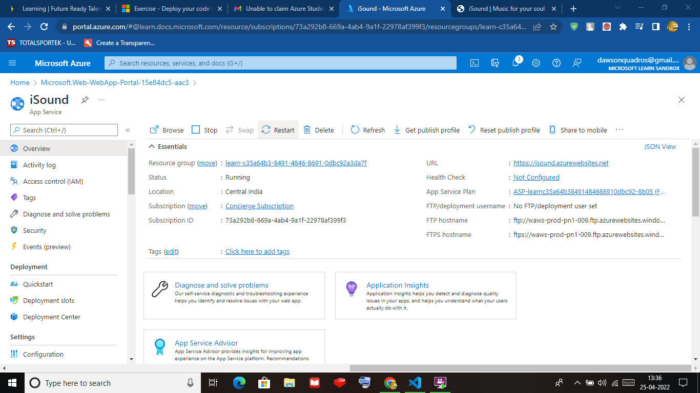
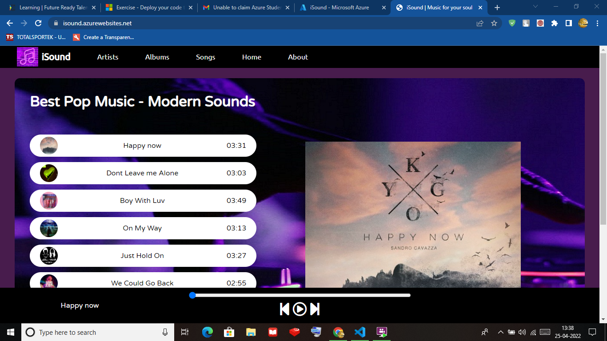
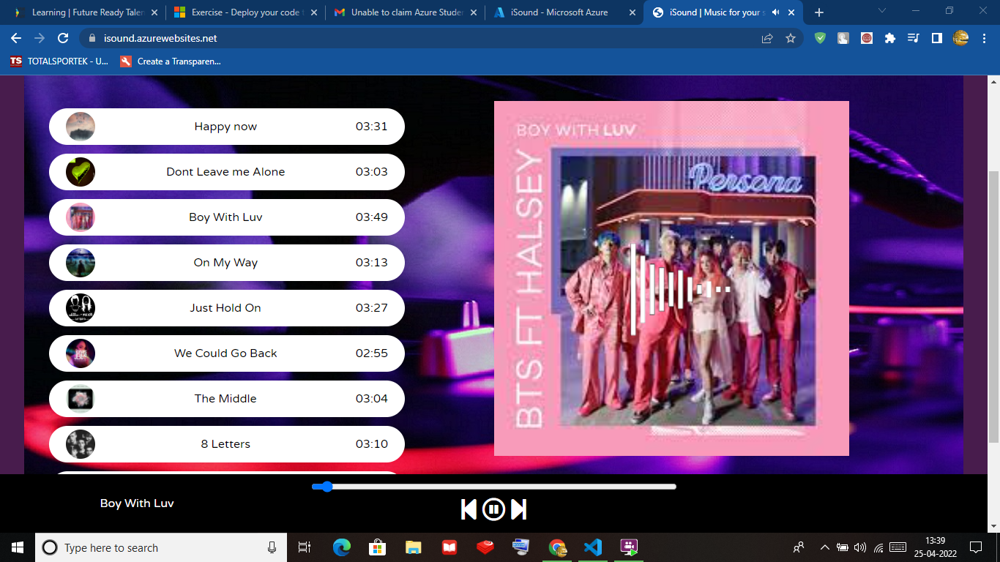
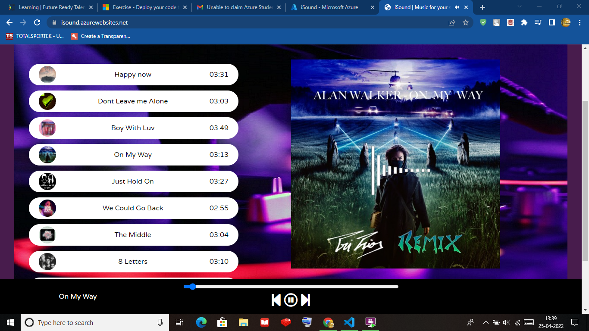
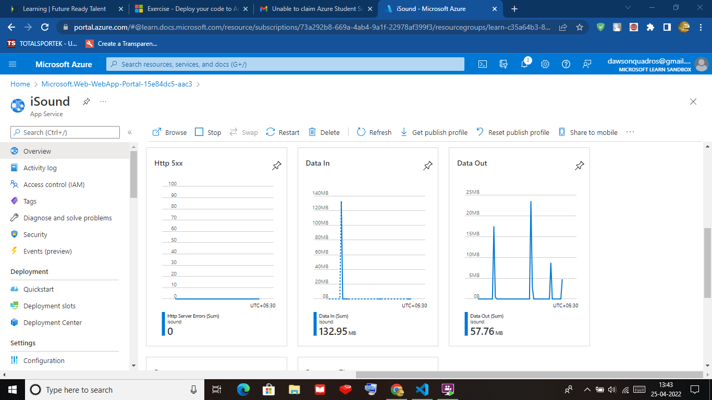
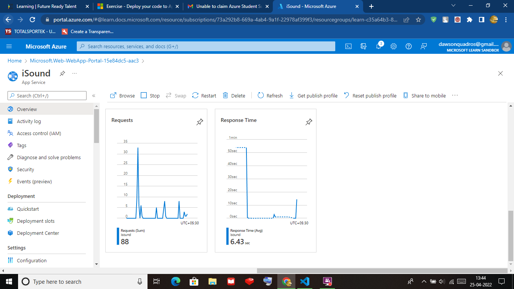
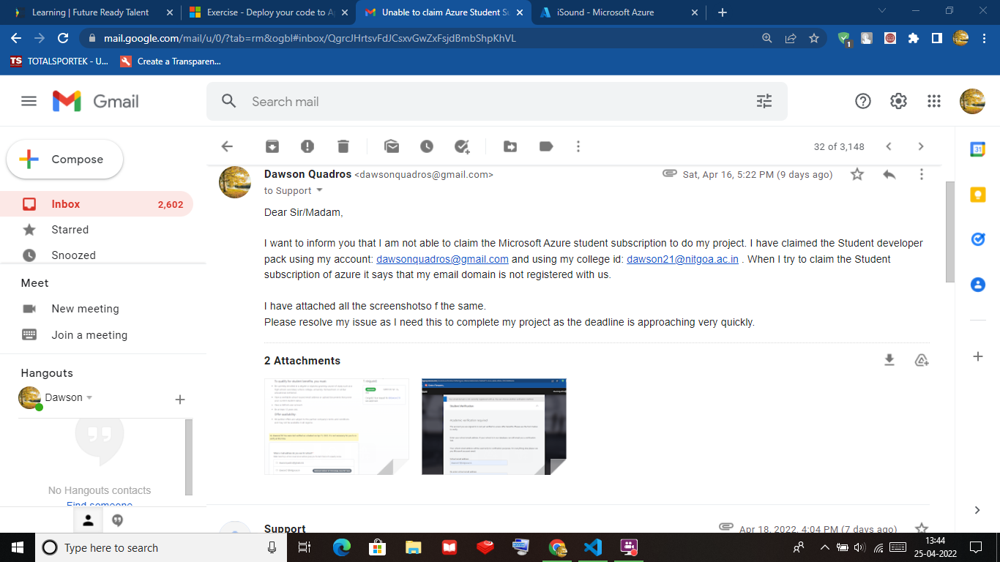
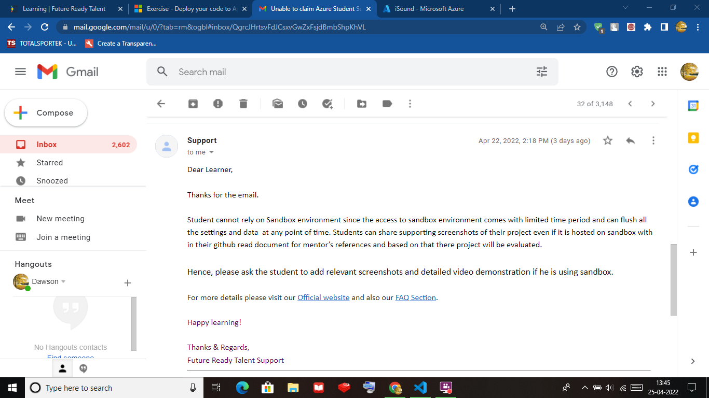

# iSound---Music-Streaming-App
This is my Project for the Microsoft Future Ready Talent Internship

Project Topic : iSound - Music Streaming Website

Technologies Used: Azure App Service , Azure App service VS Code Extension.

iSound is a hip new website where you can play your favourite songs, it has functionalities like , play/pause , previous song, next song etc.

Here is the Azure service resource in the Azure Portal:

Here are the Screenshots of the Working of the Websites:

We can See that the Website is hosted at : isound.azurewebsites.net

Here are the analytics for the Website:

I used the Azure App Service VS Code extension to deploy my code to the Web App

Note: I have done this Project on Sandbox because I was having Trouble creating a Azure Student Account, and after weeks of discussion with support@futurereadytalent the issue couldnt be resolved and he advised me to do the Project on sandbox , here are the Screenshots of the conversation Please Consider.

